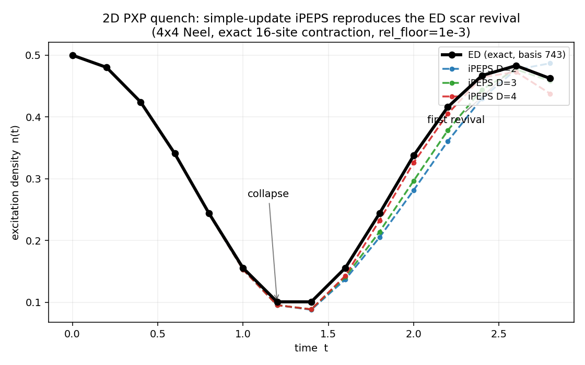

# SquarePXPDynamics.jl

`SquarePXPDynamics` is a Julia package for PEPS-based dynamics on the
2D square-lattice PXP model: simple-update iPEPS Trotter evolution,
local/CTMRG observables, ED reference benchmarks, and a ScarFinder
candidate-search loop.



**Milestone:** simple-update iPEPS reproduces the exact-diagonalization
collapse-and-revival of the 2D PXP quantum many-body scar model (4x4 Neel quench
to the first revival), measured by an exact 16-site contraction. By the n(t)
trajectory error the bond-dimension ladder converges monotonically toward ED
(D=4 best of 2-4).

## Requirements

- Julia 1.12 or newer (the package pins `julia = "1.12"` in `Project.toml`).
- PEPSKit 0.7, ITensors 0.9, TensorKit 0.15, ITensorMPS 0.3.x.

## Quick start

```julia
using SquarePXPDynamics

# Periodic 10x10 unit cell, all-down product state, bond dimension 1.
cell = PeriodicSquareUnitCell(10, 10)
psi = product_square_ipeps(cell; state = :down, maxdim = 1)

# One Trotter step at dt = 0.01 using the current 5-argument TrotterParams.
params = TrotterParams(0.01, 1, :real, 1, 1e-12)
evolve!(psi, 0.01; params = params)

# Cheap simple-update diagnostics.
summary = measure_simple(psi)
@show summary.density summary.pxp_energy_density
```

`measure_simple` returns simple/local diagnostics only — useful for smoke
tests and regression checks, **not** CTMRG-quality measurements.

## Where to look

| If you want…                                | Look at |
|---|---|
| Public API and exports                      | `src/SquarePXPDynamics.jl` |
| Per-module narrative                        | `## Currently shipped` below |
| Durable knowledge: findings, conventions, methodology, decisions | `notes/` (start at `notes/README.md`) |
| How to evaluate the dynamics (read first)   | `notes/methodology/revival-validation.md` |
| Original design specs / multi-stage plans   | `docs/superpowers/specs/`, `docs/superpowers/plans/` |
| Historical / superseded notes               | `notes/archive/` |
| Agent-facing instructions                   | `AGENTS.md` |
| Autonomous-loop prompts                     | `prompts/` |

## Status

The package does simple-update iPEPS real-time dynamics of the 2D square-lattice
PXP (Rydberg-blockade / quantum many-body scar) model, validated against exact
diagonalization. Core pipeline: Gamma-lambda (Vidal) iPEPS states, QR-reduced
five-site "star" updates (`project_star!`), deterministic Trotter evolution
(`evolve!`), and measurement via either an exact finite contraction (small cells,
trusted) or PEPSKit CTMRG (`measure_ctm`). ED references use a constraint-resolved
PXP basis (`FinitePXPEEDBenchmark.jl`, `PXPValidation.jl`).

Progress against the three project goals:

1. **Reliable dynamics matching ED — largely achieved up to D=4.** On the 4x4
   Neel quench to the first scar revival, the iPEPS `n(t)` trajectory converges
   monotonically toward ED as bond dimension grows (trajectory RMS error D=2
   2.6e-2 -> D=4 9.8e-3; see the figure above). The trusted measurement is the
   exact 16-site contraction `exact_density_finite(max_sites = 16)` — CTM chi=8
   was found to *flatter* the revival error by ~3-13e-3, so it is not used for the
   headline benchmark. **Methodology:** judge revival dynamics by the `n(t)`
   trajectory, never a single time — the revival peak (t~2.6) is a curve-crossing
   point that scrambles the per-D ranking. The oracle has two exact backends
   (`method = :dense | :boundary | :auto`, agreeing to ~1e-9): the single-layer
   dense path is memory-pathological for *entangled* D>=5 on a 16-site torus
   (~244 GB observed), so a memory-bounded double-layer boundary contractor
   (`method = :boundary`) was added. It is correct but slow at full-rank D>=5, so
   the *entangled* D=5,6 trajectory still needs a faster contraction — see
   `notes/stage2-truncation/improvement-roadmap.md` (priority #1).

2. **Bond truncation + conditioning — partial.** Simple update truncates against
   the single-site lambda^2 mean-field environment. A relative singular-value
   condition floor (`rel_floor`, default 1e-3) caps the bond condition number and
   removes a short-time tight-cutoff instability. Environment-aware (full/cluster)
   update — truncating against a real bond environment — is the main open item.

3. **ScarFinder (better-than-Neel initial state) — scaffolding only.** A
   single-seed evolve/measure/rank loop exists (`ScarFinder.jl`); a real search
   over initial states, a return-amplitude / Loschmidt objective, and a Neel
   baseline are future work.

Simple/local observables (`measure_simple`) are development diagnostics only, not
CTMRG-quality measurements — do not make D>1 physics claims from them. The dense
square-star PXP Hamiltonian is the source of truth for the energy operator (site
order `(center, right, up, left, down)`, basis `1 = :up`, `2 = :down`).

### PEPSKit-native backend migration (in progress)

The package is migrating its tensor stack from the custom ITensors Γ-λ iPEPS
backend to a **PEPSKit-native** backend (PEPSKit's `InfinitePEPS` + `SUWeight`),
introduced *in parallel* so parity can be proven before anything is deleted. The
end state is a single tensor engine with no ITensors dependency and a
substantially smaller codebase. See `docs/pepskit-native-refactor.md` for the
full design, milestones, and consolidation roadmap.

Landed so far:

- **Native state / gate / update / evolution / observables** (`PEPSKitBackend`,
  `PEPSKitStarUpdate`, `PEPSKitEvolution`, `PEPSKitObservables`): the
  PEPSKit-native `PXPIPEPSState`, the genuine five-site square-star gate and
  simple update (`project_star_pepskit!`), the five-colour Trotter driver
  (`evolve_pepskit!`), and both CTMRG and simple observables. The native
  single-step star update matches the legacy backend to ~1e-6.
- **Tensor-engine selector.** ScarFinder, the audit harness, and
  `validate_pxp_ed_ipeps` accept a `tensor_engine` of `:legacy_itensors`
  (default) or `:pepskit_simple`, dispatching the same orchestration onto either
  backend through the shared `measure_simple` / `evolve!` / `reverse_evolve!`
  generics.
- **Native validation.** Direct native↔ED short-time comparison (bit-for-bit
  versus the ED-validated legacy engine at `D = 1`) and a multi-step
  reversibility audit, plus native JLD2 candidate snapshots
  (`write_pxp_pepskit_snapshot` / `load_pxp_pepskit_snapshot`).
- **Experimental** (`PEPSKitStarSnake`): an exact matrix-product-operator
  factorization of the five-site star gate (`star_gate_mpo`), for research only —
  *not* wired into production evolution.

The **legacy ITensors backend remains the production default** and is retained
intentionally; it will be deleted incrementally as each native equivalent
(per-iteration compression, CTM-trust, imaginary-time energy correction) reaches
parity and ScarFinder's production path is re-pointed. The remaining
ITensors-coupled files are `SquareIPEPS.jl`, `StarSimpleUpdate.jl`,
`IPEPSEvolution.jl`, the conversion half of `PEPSKitMeasurements.jl`, and the
ITensors half of `Observables.jl`.

## Package Layout

- `Project.toml`: package metadata, dependencies, compatibility bounds, and the test workspace.
- `src/SquarePXPDynamics.jl`: package module entrypoint.
- `src/*.jl`: implementation modules included by the entrypoint.
- `test/runtests.jl`: package test runner.
- `test/Project.toml`: test-only environment for Julia's workspace-based test dependency workflow.

## Currently shipped

- `SquarePXPDynamics.jl` — package entrypoint and public API surface.
- `Lattice.jl` — square-lattice geometry, periodic unit cells, 5-site star scheduling.
- `PXPModel.jl` — dense square-star PXP Hamiltonian, blockade projector, real/imaginary projected gates.
- `SquareIPEPS.jl` — periodic Gamma-lambda iPEPS states (product, checkerboard/Neel), link-weight normalization, bond-entropy diagnostics.
- `StarSimpleUpdate.jl` — QR-reduced five-site star update (`project_star!`, with touched-link conditioning diagnostics and the `rel_floor` SV condition floor) and `canonicalize_simple!` Vidal regauging.
- `IPEPSEvolution.jl` — deterministic Trotter evolution (`evolve!`, `reverse_evolve!`), serial/five-color schedules, `TrotterParams`, log-normalization ledger.
- `Observables.jl` — simple/local observables (`measure_simple`) and exact finite-contraction observables (`dense_state_finite`, `exact_density_finite` with `:dense`/`:boundary`/`:auto` backends, energy / return probability) for small cells.
- `PEPSKitMeasurements.jl` — PEPSKit/TensorKit CTMRG density / blockade / PXP-energy measurement adapter (`measure_ctm`).
- `CTMTrust.jl` — finite-`chi` CTM trust assessment and audit CSV (`assess_ctm_trust`).
- `FinitePXPEEDBenchmark.jl` — constraint-resolved PXP exact-diagonalization reference (Krylov dynamics, density operators).
- `PXPValidation.jl` — ED-vs-iPEPS validation / convergence reports (`validate_pxp_ed_ipeps`, `validate_pxp_convergence`) and the larger-D ED benchmark (`run_pxp_larger_d_benchmark`).
- `ScarFinder.jl`, `ScarFinderSupport.jl`, `ScarFinderAudit.jl` — single-seed candidate-state evolve/measure/rank loop, objectives, optional trusted-CTM backend, audit harness, and JLD2 candidate snapshots (legacy + native).
- `Internals.jl` — shared internal helpers.

PEPSKit-native backend (see the migration note above and `docs/pepskit-native-refactor.md`):

- `PEPSKitBackend.jl` — PEPSKit-native `PXPIPEPSState` (`InfinitePEPS` + `SUWeight`), product/checkerboard constructors, shared state generics, and the dense-operator→`TensorMap` helpers.
- `PEPSKitStarUpdate.jl` — native five-site square-star gate and the `project_star_pepskit!` simple update.
- `PEPSKitEvolution.jl` — native Trotter driver (`evolve_pepskit!`) preserving the five-colour palindromic schedule.
- `PEPSKitObservables.jl` — native CTMRG observables plus the simple/local observables and the `measure_simple`/`evolve!`/`reverse_evolve!` adapters and `pxpipeps_from_square_ipeps` converter.
- `PEPSKitStarSnake.jl` — experimental exact MPO factorization of the star gate (research only, not in production).

## Not Yet Shipped

- CTM-aware/full-update evolution.
- Calibrated CTM trust thresholds for production audits (the
  `tight_ctm_trust_policy()` and `calibrated_ctm_trust_policy(...)`
  factories ship as of 2026-05-26; the numerical thresholds adopted as
  per-`D` defaults still depend on the first production calibration run,
  documented in `docs/superpowers/notes/2026-05-26-ctm-trust-calibration.md`).
- Published acceptance verdict for the first audit campaign (the harness,
  driver script, and threshold framework ship; the campaign result lives
  in `docs/superpowers/notes/2026-05-26-scarfinder-acceptance.md` once
  populated).

## Minimal Example

See the **Quick start** at the top of this README for the PXP minimal flow
using the current 5-argument `TrotterParams` constructor. Two notes:

- The legacy 6-argument constructor (`TrotterParams(dt, order, evolution,
  projected::Bool, maxdim, cutoff)`) is still accepted via
  [`legacy_trotter_params`](@ref) for compatibility with older scripts.
  New code should use the 5-argument keyword form shown above.
- `measure_simple` returns simple/local diagnostics only. They are useful for
  smoke tests and regression checks, but they are not CTMRG-quality
  measurements; route physics-facing measurements through
  [`measure_ctm`](@ref) and [`measure_ctm_trusted`](@ref).

### PXP ED Benchmark

The package also includes an EDKit-backed finite PBC PXP benchmark path for
short-time dynamics in the fully symmetric sector. The `7 x 7` runner is:

```bash
julia --project=. scripts/pxp_ed_7x7_benchmark.jl
```

The script writes JSON by default to `scripts/pxp-ed-7x7.json`. Runtime knobs
are environment variables, for example
`PXP_ED_TOTAL_TIME=0.05 PXP_ED_M_MAX=40 julia --project=. scripts/pxp_ed_7x7_benchmark.jl`.

For the M3 larger-D benchmark path, run the manual `7 x 7` capacity-boundary
probe with:

```bash
SQUAREPXP_LARGERD_N=7 \
SQUAREPXP_LARGERD_DT=0.01 \
SQUAREPXP_LARGERD_D=1 \
SQUAREPXP_LARGERD_TOTAL_TIME=0.0 \
SQUAREPXP_LARGERD_USE_SPARSE=false \
SQUAREPXP_LARGERD_JSON=artifacts/m3-7x7-capacity.json \
SQUAREPXP_LARGERD_CSV=artifacts/m3-7x7-capacity.csv \
julia --project=. scripts/pxp_larger_d_ed_benchmark.jl
```

`7 x 7` is the largest square PBC size supported by the current `UInt64`
basis. This command is a capacity boundary probe, not a default test. If it is
too slow or memory-heavy, use `scripts/pxp_ed_7x7_benchmark.jl` with
`PXP_ED_USE_SPARSE=false` for ED-only diagnosis and record the runtime boundary
in the M3 note.

An experimental PEPSKit CTMRG measurement adapter is present as `measure_ctm`,
with CTMRG density, blockade, sublattice imbalance, checkerboard structure
factor, and five-site PXP energy diagnostics. Check the raw CTMRG convergence
information and finite-chi sensitivity before treating these measurements as
physics-quality observables. `measure_ctm_trusted` and
`TrustedCTMBackend` package that finite-`chi` sweep, the final CTM summary,
and the `assess_ctm_trust` result for downstream validation and ScarFinder
ranking.

```julia
params_ctm = PEPSKitCTMRGParams(8, 1e-8, 100, 0)
ctx = pepskit_ctmrg_context(psi; params = params_ctm)
energy = pxp_energy_density_ctm(psi, ctx)
diagnostics = ctm_diagnostics(ctx)
```

Inspect `diagnostics` before using CTM values for ranking, and repeat CTM
measurements at multiple `chi` values before trusting energy comparisons. A
`PEPSKitMeasurementContext` belongs to the exact state used at creation; if
`psi` is mutated by `evolve!`, `project_star!`, or link-weight setters, the old
context is stale and measurement calls throw. `ScarFinderCandidateScore.score`
is the selected objective score. For simple/local default runs it is still only
a diagnostic sorting key. ScarFinder CSV/JSON logs include objective metadata,
CTM trust fields when available, `log_norm_before`, `log_norm_after`,
`log_norm_delta`, `correction_accepted`, `correction_energy_before`, and
`correction_energy_after` so long projection sweeps and guarded correction
attempts can be screened. The public mutators update the state version; direct
edits to `psi.tensors`, `psi.link_weights`, or `psi.link_indices` are internal
mutable implementation details and can bypass cache-staleness bookkeeping.

For finite-`chi` validation sweeps, use:

```julia
points = validate_ctm_sweep(
    psi;
    params = [
        PEPSKitCTMRGParams(4, 1e-6, 50, 0),
        PEPSKitCTMRGParams(8, 1e-8, 100, 0),
    ],
)
assessment = assess_ctm_trust(points)
write_ctm_validation_csv(points, "ctm-validation.csv")
write_ctm_trust_csv(points, "ctm-trust.csv")
```

Each `CTMValidationPoint` records the CTM summary, the simple/local reference,
observable deltas, and CTMRG diagnostics for one parameter setting.
`assess_ctm_trust` compares the final finite-`chi` CTM measurements against
each other; it does not use the simple/local reference deltas stored in
`CTMValidationPoint`. A trusted assessment is a measurement-validation signal,
not permission by itself to run gauge-changing updates. `ctm_ready_for_gauge_updates`
adds the separate S7b checks for fresh contexts and local CTM bond norm
diagnostics. `fix_bond_gauge!` is transactional: D=1 product bonds are a no-op,
and D>1 bonds are conditioned with PEPSKit bond-environment factorization before
the updated tensors are written back to the Gamma-lambda iPEPS state.

### PXP validation reports

The first production-facing validation path is
`validate_pxp_ed_ipeps(PXPValidationConfig(...))`. It runs a finite periodic
PXP ED trajectory, evolves a matched all-down iPEPS trajectory on the same
unit cell, and reports density differences at shared sample times. Without CTM,
the simple-density difference is a local-environment diagnostic; for D>1 loopy
periodic PEPS it is not an exact finite contraction. Passing
`ctm_params = (...)` attaches `measure_ctm_trusted` output at every sample:
the final CTM measurement, the finite-`chi` sweep points, and the
`assess_ctm_trust` result.

For a fast JSON artifact without CTMRG:

```julia
config = PXPValidationConfig(3; total_time = 0.02, dt = 0.01)
report = validate_pxp_ed_ipeps(config; ctm_params = nothing)
write_pxp_validation_json(report, "artifacts/pxp_validation_report.json")
```

For tiny periodic cells, validation can attach an exact finite contraction
density alongside simple/local and CTM fields:

```julia
config = PXPValidationConfig(
    3;
    total_time = 0.02,
    dt = 0.02,
    maxdim = 2,
    exact_finite_observables = true,
    exact_finite_max_sites = 12,
)
report = validate_pxp_ed_ipeps(config; ctm_params = nothing)
```

The exact finite path is intentionally size-limited and uses dense `2^N`
contractions of the supplied `SquareIPEPSState`. It is a debugging and
tiny-cell validation reference, not exact ED dynamics and not a replacement for
CTM-backed thermodynamic measurements.

or from the shell:

```bash
julia --project=. scripts/validate_pxp_ed_ipeps.jl
```

This is a validation harness, not a ScarFinder ranking change. ScarFinder still
uses its existing simple/local default for fast development runs. Use the
trusted backend path below for CTM-gated ranking.

### ScarFinder trusted ranking

ScarFinder now accepts explicit objectives and measurement backends. The simple
default remains useful for smoke tests:

```julia
result = scarfinder!(
    psi;
    iterations = 3,
    params = params,
    objective = CompositeObjective(; revival = RevivalObjective()),
)
```

For physics-facing candidate ranking, use trusted finite-`chi` CTM measurement
and a hard trust gate:

```julia
backend = TrustedCTMBackend(
    [
        PEPSKitCTMRGParams(8, 1e-7, 100, 0; seed = 11),
        PEPSKitCTMRGParams(12, 1e-8, 150, 0; seed = 11),
    ],
    CTMTrustPolicy(),
)

result = scarfinder!(
    psi;
    iterations = 5,
    params = params,
    measurement = backend,
    objective = CompositeObjective(; revival = RevivalObjective()),
    require_trusted_ctm = true,
    candidate_store = JSONCandidateStore("artifacts/scarfinder-candidates"),
)
```

`JSONCandidateStore` writes metadata and score records for auditability.
`JLD2CandidateStore(directory)` also writes a JLD2 tensor snapshot per
iteration so candidates can be exactly reloaded later via
`load_square_ipeps_snapshot(path)`. Both stores share the same JSON metadata
layout.

### ScarFinder audit harness

`run_scarfinder_audit(config; objective)` runs ScarFinder on a
`(dt, D, cutoff)` and optional `chi` grid, captures per-row best
candidates and trusted-CTM counts, and reports a cross-row stability
summary (`best_iteration_agreement`, `top_k_jaccard_min`,
`score_cv`). See `scripts/run_scarfinder_audit.jl` for the driver and
`docs/superpowers/notes/2026-05-26-scarfinder-acceptance.md` for the
acceptance-threshold framework. The companion CTM calibration script is
`scripts/run_ctm_chi_sensitivity.jl`; the threading recipe is
`docs/superpowers/notes/2026-05-26-ctm-throughput-recipe.md`.

For coarse error-budget artifacts, run:

```julia
config = PXPConvergenceConfig(
    PXPValidationConfig(3; total_time = 0.02, dt = 0.01);
    dt_values = [0.02, 0.01],
    D_values = [1, 2],
    cutoff_values = [1e-10],
    chi_values = [8, 12],
)
report = validate_pxp_convergence(config)
write_pxp_convergence_json(report, "artifacts/pxp_convergence_report.json")
```

For the M1 PXP audit campaign, use `run_pxp_audit_campaign`. It runs the
small all-down ED/iPEPS validation grid, adds a reversibility report per grid
point, and writes both nested JSON and a flat CSV summary:

```julia
config = PXPAuditConfig(;
    n_values = [3],
    total_time = 0.02,
    dt_values = [0.02, 0.01],
    D_values = [1, 2],
    cutoff_values = [1e-12],
    chi_values = Int[],
)
report = run_pxp_audit_campaign(config)
write_pxp_audit_json(report, "artifacts/pxp_audit_report.json")
write_pxp_audit_csv(report, "artifacts/pxp_audit_summary.csv")
```

or from the shell:

```bash
julia --project=. scripts/pxp_audit_campaign.jl
```

Set `SQUAREPXP_AUDIT_CHI=8,12` to attach trusted CTM finite-`chi` sweeps.
Other useful overrides are `SQUAREPXP_AUDIT_N=3,4`,
`SQUAREPXP_AUDIT_DT=0.02,0.01,0.005`, `SQUAREPXP_AUDIT_D=1,2`,
`SQUAREPXP_AUDIT_CUTOFF=1e-10,1e-12`, `SQUAREPXP_AUDIT_TOTAL_TIME=0.02`,
`SQUAREPXP_AUDIT_JSON=...`, and `SQUAREPXP_AUDIT_CSV=...`.

The CSV summary is for bottleneck triage. Large `max_abs_density_error_simple`
with small reversibility drift means the simple/local no-CTM diagnostic has
separated from the ED density; for D>1 this may be a local-environment effect,
not an exact finite PEPS update error. CTM density error or rejected
`ctm_trust_status` points at finite-`chi` drift; large `max_truncerr` points at
bond-dimension/truncation pressure; large `log_norm_delta_abs` or reversibility
drifts point at persistence or round-trip stability. These are audit signals
only, not physics-grade claims.

### M3 larger-D PXP ED benchmark

Use `run_pxp_larger_d_benchmark` for larger-D sweeps against finite PBC ED:

```julia
config = PXPLargerDBenchmarkConfig(;
    n_values = [3],
    total_time = 0.02,
    dt_values = [0.02, 0.01],
    D_values = [1, 2, 3, 4],
    cutoff_values = [1e-12],
    exact_finite_observables = true,
    exact_finite_max_sites = 9,
)
report = run_pxp_larger_d_benchmark(config)
write_pxp_larger_d_benchmark_json(report, "artifacts/m3-larger-d.json")
write_pxp_larger_d_benchmark_csv(report, "artifacts/m3-larger-d.csv")
```

or from the shell:

```bash
SQUAREPXP_LARGERD_N=3 \
SQUAREPXP_LARGERD_DT=0.02,0.01 \
SQUAREPXP_LARGERD_D=1,2,3,4 \
SQUAREPXP_LARGERD_CUTOFF=1e-12 \
SQUAREPXP_LARGERD_TOTAL_TIME=0.02 \
SQUAREPXP_LARGERD_EXACT_FINITE=true \
SQUAREPXP_LARGERD_EXACT_FINITE_MAX_SITES=9 \
julia --project=. scripts/pxp_larger_d_ed_benchmark.jl
```

The ED reference is finite periodic and symmetry-reduced. Its density is a
global site average in the selected symmetric sector. It is not a central 3x3
or local-window observable. For D>1, `density_error_simple` remains a simple
environment diagnostic; use `density_error_exact_finite` for 3x3 finite
validation and CTM-trusted fields only when finite-`chi` trust sweeps were run.

## Development

Instantiate the package environment:

```bash
julia --project=. -e 'using Pkg; Pkg.instantiate()'
```

Load the package from the repository root:

```bash
julia --project=. -e 'using SquarePXPDynamics'
```

Run the package tests:

```bash
julia --project=. -e 'using Pkg; Pkg.test()'
```

Run the slower extended CTM tests locally:

```bash
SQUAREPXP_EXTENDED_TESTS=1 julia --project=. -e 'using Pkg; Pkg.test()'
```

Run the optional PXP ED benchmark smoke:

```bash
SQUAREPXP_EXTENDED_PXP_ED_TESTS=1 julia --project=. test/runtests.jl test_pxp_larger_d_ed_benchmark.jl
```

This does not run 7x7. Large 7x7 probes are manual benchmark commands.

The same extended CTM suite is available in GitHub Actions through the
`Extended CTM` manual workflow and its weekly scheduled run.

The test suite includes API docstring coverage for exported names and Aqua.jl
package-quality checks.
